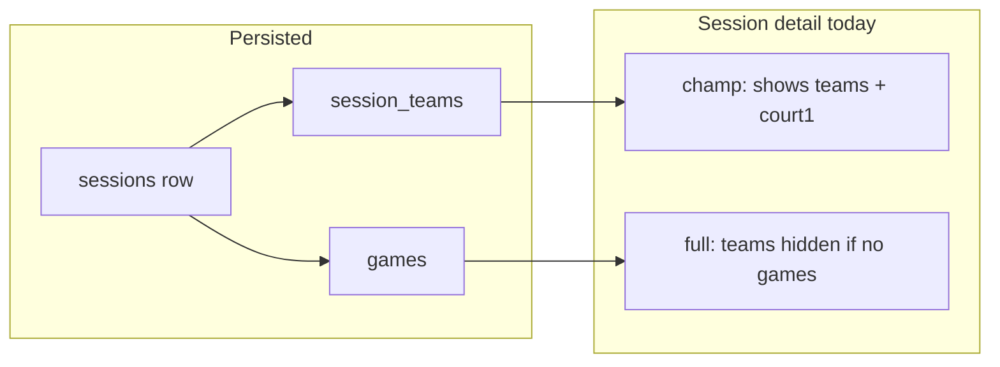

# Session teams, scores entry, and adaptive player UX

## Current behavior (baseline)

- **Create flow:** [`saveNewSessionDraft`](app/actions/session-wizard.ts) inserts a `sessions` row, then calls [`upsertSessionTeams`](app/actions/session-wizard.ts) when `payload.teams.length > 0`, writing to `public.session_teams`. Navigating to [`/sessions/[sessionId]/edit`](app/(app)/(main)/leagues/[leagueId]/sessions/[sessionId]/edit/page.tsx) allows further saves via the same actions.
- **List:** [`LeagueSessionsList`](components/league-sessions-list.tsx) links each row to [`/leagues/[leagueId]/sessions/[sessionId]`](app/(app)/(main)/leagues/[leagueId]/sessions/[sessionId]/page.tsx) (detail view), not directly to edit.
- **Scores editing:** Only admins reach the wizard on [`.../edit`](app/(app)/(main)/leagues/[leagueId]/sessions/[sessionId]/edit/page.tsx); non-admins are redirected to the detail page ([`redirect` when not owner/admin](app/(app)/(main)/leagues/[leagueId]/sessions/[sessionId]/edit/page.tsx)).
- **Detail page gap:** [`SessionPage`](app/(app)/(main)/leagues/[leagueId]/sessions/[sessionId]/page.tsx) loads `session_teams` **only when** `input_mode === 'champ_court_only'` (see ~lines 111–117). For **full** mode, saved teams are not shown unless they appear inside `games` rows—so a draft with teams saved but no games yet looks empty aside from "No games logged yet."

## Recommended implementation

### 1. Always load and show teams on the session detail page

- In [`page.tsx`](app/(app)/(main)/leagues/[leagueId]/sessions/[sessionId]/page.tsx), **always** query `session_teams` (ordered by `sort_order`) for both `full` and `champ_court_only`, not only in champ mode.
- Add a **Teams** card for full mode when `sessionTeamRows.length > 0`, mirroring the champ table’s team labeling (reuse `formatTeam` / player name resolution already used for games).
- Merge team players into `playerIds` for ratings lookup (already partially done for champ via `sessionTeamRows`; extend so full mode includes those IDs even before games exist).

This directly addresses “teams saved in sessions” being **visible** after save, and makes the session clickable destination meaningful before any scores exist.

### 2. Derive “ready for scores” (draft UX)

- Compute helpers on the server (same page or small `lib/session-readiness.ts`):
  - `hasTeams` = `session_teams` count > 0.
  - `teamsCoverCourts` ≈ team pairs ≥ `num_courts` (same rule the wizard uses: `courts * 2` pairs). Align with [`SessionCreateWizard`](components/session-create-wizard.tsx) expectations (`teamsRequired`, etc.) so wording stays consistent.
- **Admin + draft:** Adjust the existing “Finalize session” / [`CompleteSessionButton`](components/complete-session-button.tsx) area:
  - If `!hasTeams` or `!teamsCoverCourts`: short explanation + primary CTA **Edit session** (link to `/edit`) to finish teams first.
  - If teams are sufficient but games/court1 data incomplete: existing “add results then complete” messaging.
- **Non-admin:** No edit affordance (unchanged); copy can say scores are entered by organizers until completed.

### 3. Participant-aware “player view” (owner can be a player)

- Resolve the current user’s **`players.id`** (same pattern as [`getOnboardingState`](lib/auth/profile.ts): `players.user_id = auth user id`). Reuse `requireOnboarded()` which already exposes `player` where applicable, or query `players` once on the session page.
- Build the set of **session player ids** from: `session_teams` (all four per pair), `games` team arrays, and `session_court1_pair_wins` for champ.
- Flags:
  - `isParticipant` = current user’s `player.id` is in that set (if no linked player row, false—guest-only users are not “logged-in players”).
  - `canAdmin` = existing membership check (owner/admin).

**UI behavior:**

| Role | Adaptation |
|------|------------|
| `canAdmin` only | Current admin chrome (Edit, Complete, delete game when draft). |
| `canAdmin && isParticipant` | Keep admin actions; add a compact **“You’re playing”** banner (and optional team index label if cheap to compute from `session_teams` order). |
| `!canAdmin && isParticipant` | Emphasize read-only **“Your session”** framing: show teams + games/court1 clearly; avoid implying they can edit scores. |
| `!isParticipant` | Neutral spectator copy (“Roster session” / league context). |

This satisfies “owner can also be a player”: owners keep admin capabilities while the layout reflects participation when `isParticipant` is true.

### 4. Optional: league session list hints

- In [`LeagueSessionsList`](components/league-sessions-list.tsx) (or the parent that already has `session_teams` counts), add subtle secondary text or badge for drafts: e.g. “Teams set” vs “Needs teams” using existing `session_teams[0].count` and `num_courts` already on `LeagueSessionRow`. Keep copy short to avoid clutter.

### 5. Leaderboard profile pictures and #1 “Roman winner” gold styling

**Context:** Standings tables in [`LeaguePageTabs`](components/league/league-page-tabs.tsx) render **player name text only** for [`LeaderboardRow`](lib/leaderboard.ts) rows. [`player_stats`](app/(app)/(main)/leagues/[leagueId]/page.tsx) is queried with `players ( name )` only—no `avatar_url`. Pair rows use `label` strings only; [`pairPlayerMetaById`](app/(app)/(main)/leagues/[leagueId]/page.tsx) already loads `avatar_url` for spotlight but not for the **Championship pairs** table body.

**Avatars (all leaderboard rows):**

- Extend the `player_stats` select to include nested `users ( username, avatar_url )` (same shape as [`pairPlayerRows`](app/(app)/(main)/leagues/[leagueId]/page.tsx)), or batch-fetch avatars for all `player_id`s in `leaderboardRaw`.
- Optionally extend [`LeaderboardRow`](lib/leaderboard.ts) with `avatar_url` / `username` **or** pass a `Record<player_id, { avatar_url, username }>` into `LeaguePageTabs` to avoid widening types everywhere.
- In standings tables, render [`UserAvatarDisplay`](components/user-avatar-display.tsx) beside the player name (flex row, gap-2). Guests without a linked user keep initials-only behavior from existing avatar component.
- **Championship pairs** table: show **two** small avatars (from `pairPlayerMetaById` for `player_low` / `player_high`) plus the existing label; guest-only players may lack avatars—fallback is acceptable.

**Gold #1 styling (rank 1 player + rank 1 pair):**

- For `idx === 0` in each relevant table (primary **Player leaderboard** per league mode, and **Championship pairs** when that table is the main ranking), wrap the avatar(s) in a small decorative frame:
  - **Visual direction:** classical “victor” look—**gold-toned ring** plus optional **laurel-wreath** motif (inline SVG or subtle CSS `mask`/`background`); avoid cluttering every row—only **first place**.
  - Reuse or extract a tiny component, e.g. `WinnerAvatarFrame` / `LaurelRankOne`, applied to:
    - Full leaderboard tables in [`league-page-tabs.tsx`](components/league/league-page-tabs.tsx).
    - [`LeagueSpotlightPodium`](components/league/league-spotlight-podium.tsx) [`PlayerPillar`](components/league/league-spotlight-podium.tsx) / [`PairPillar`](components/league/league-spotlight-podium.tsx) when `rank === 1` (today: `Trophy` + light `ring`; upgrade to consistent gold laurel treatment so spotlight matches tables).
- Keep contrast acceptable in **light and dark** mode (use CSS variables / `amber`–`yellow` palette with ring opacity, not hard-coded white-only).

### 6. Out of scope / product decisions (do not implement unless you ask)

- Letting **non-admin players** edit scores (would need RLS and new server actions).
- Forcing **teams on first Save draft** in the wizard (would change [`saveNewSessionDraft`](app/actions/session-wizard.ts) validation).

## Files to touch

- Primary: [`app/(app)/(main)/leagues/[leagueId]/sessions/[sessionId]/page.tsx`](app/(app)/(main)/leagues/[leagueId]/sessions/[sessionId]/page.tsx) — load `session_teams` for all modes, Teams card, readiness messaging, participant banner, optional `player` resolution.
- Optional: [`components/league-sessions-list.tsx`](components/league-sessions-list.tsx) — list hints.
- Optional small helper: [`lib/session-readiness.ts`](lib/session-readiness.ts) — pure functions for `teamsCoverCourts` given `num_courts` and team count.
- Leaderboards: [`app/(app)/(main)/leagues/[leagueId]/page.tsx`](app/(app)/(main)/leagues/[leagueId]/page.tsx) (query / maps), [`components/league/league-page-tabs.tsx`](components/league/league-page-tabs.tsx) (table cells), [`lib/leaderboard.ts`](lib/leaderboard.ts) (optional type fields), new small UI component for laurel/gold frame, [`components/league/league-spotlight-podium.tsx`](components/league/league-spotlight-podium.tsx) (#1 styling alignment).

## Success criteria

- After teams are saved (full or champ), opening the session from the list shows **teams** without requiring games rows first.
- Draft sessions clearly signal **next step** for admins (finish teams vs enter scores vs complete).
- Logged-in users who are on the roster see an adapted **participant** experience; owners/admins who are also on teams see **both** admin controls and participation context.
- Leaderboards show **avatars** next to players (and both players for pairs); **first place** in each primary ranking table and in the **Top 3 spotlight** uses a consistent **gold laurel-style** winner treatment on profile pictures.
